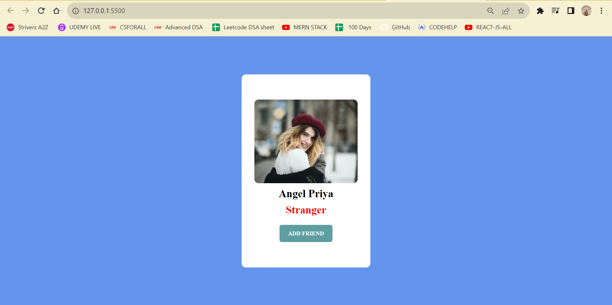
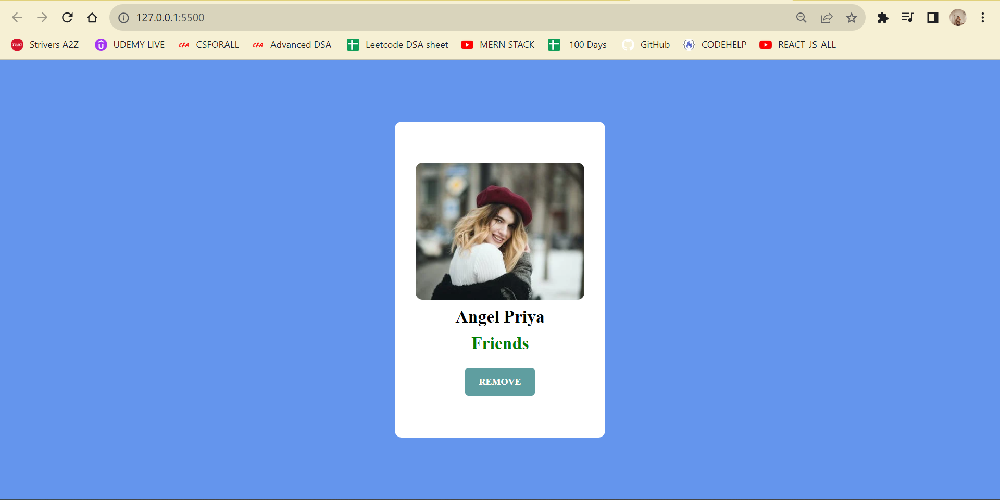

# Profile Card Toggle

This project is a simple web page that features a profile card with a toggle button. You can click the "ADD FRIEND" button to change the profile description between "Stranger" and "Friends."





## Features

- **Profile Card:** Display a profile card with the following components:
  - Profile picture
  - Name
  - Description

- **Toggle Button:** Clicking the "ADD FRIEND" button changes the description between "Stranger" and "Friends."

## Technologies Used

- HTML: Structure of the web page.
- CSS: Styling and layout of the profile card.
- JavaScript: Handling the toggle functionality.

## Usage

1. Clone the repository:

   ```bash
   git clone https://github.com/yourusername/profile-card-toggle.git
   cd profile-card-toggle
